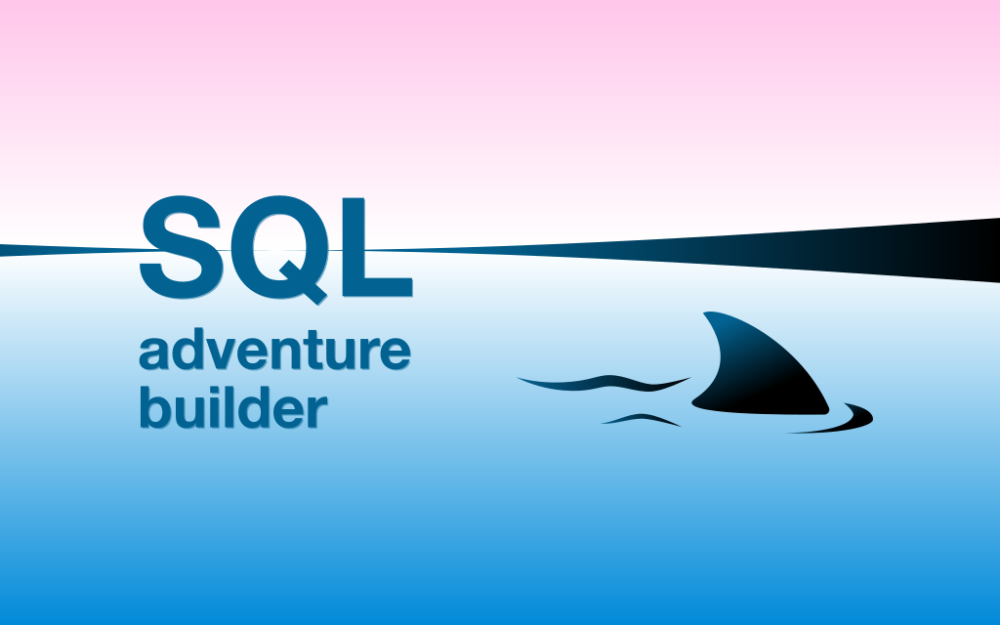

# SQLab

<p align="center">
  
</p>

<p align="center">
  <strong>Build and run SQL learning adventures with a Docker-first workflow.</strong>
</p>

<p align="center">
  This fork is tailored for running SQLab directly from the terminal through Docker,
  without manually entering a DuckDB shell first.
</p>

<p align="center">
  Forked from <a href="https://github.com/laowantong/sqlab">laowantong/sqlab</a>
</p>

<p align="center">
  
  
  
</p>

---

> [!IMPORTANT]
> This fork uses a different workflow than the original repository.
> The intended flow here is:
>
> ```bash
> # from the repository root
> docker build -t sqlab .
>
> # then from inside an adventure directory, for example wd/knowhere
> docker run --rm -it -v .:/workspace sqlab /workspace create
> docker run --rm -it -v .:/workspace sqlab /workspace shell
> ```
>
> You do **not** need to launch DuckDB manually before starting SQLab.

## Overview

SQLab is a toolkit for creating and playing SQL-based learning adventures. Each adventure lives inside a database and progresses through SQL queries: when a player writes a correct query, SQLab computes a token and decrypts the next message, hint, or story element.

This fork keeps that core idea, but simplifies the way the project is run: the repository is centered around a single Docker image and a small set of shell commands that work consistently across environments.

## Quick Start

### 1. Build the image

Run this from the repository root, where the `Dockerfile` is located:

```bash
docker build -t sqlab .
```

### 2. Change into an adventure directory

For example:

```bash
cd wd/knowhere
```

An adventure directory is a folder that contains `config.py`, `cnx.ini`, `ddl.sql`, and `records.json`.

### 3. Create or rebuild the adventure

```bash
docker run --rm -it -v .:/workspace sqlab /workspace create
```

### 4. Open the SQLab shell

```bash
docker run --rm -it -v .:/workspace sqlab /workspace shell
```

### Optional wrapper script

If you prefer shorter commands, the repository also includes a helper script:

```bash
# run from inside the adventure directory
bash sqlab.sh create
bash sqlab.sh shell
```

From the repository root, you can also point it at a bundled example adventure:

```bash
bash sqlab.sh wd/knowhere create
bash sqlab.sh wd/knowhere shell
```

## What Makes This Fork Different

The upstream project documents several ways to work with SQLab, including workflows where you start a database shell yourself and then continue from there. That is not the model this fork is optimized for.

In this fork:

- Docker is the primary entrypoint
- SQLab commands are run directly from your terminal
- the same command pattern is used for both building and playing
- the README is focused on the practical workflow students and contributors will actually use

## How The Docker Command Works

The container entrypoint is:

```bash
python -m sqlab
```

So this command:

```bash
# run from inside an adventure directory
docker run --rm -it -v .:/workspace sqlab /workspace shell
```

effectively runs:

```bash
python -m sqlab /workspace shell
```

That means the first argument must be an adventure directory containing a `config.py`.

If you are in the repository root, use an explicit path such as `/workspace/wd/knowhere`.

## Adventure Directory Layout

A typical adventure folder looks like this:

```text
your-adventure/
├── config.py
├── cnx.ini
├── ddl.sql
├── records.json
├── dataset/
│   └── *.tsv
├── relational_schema/        # optional
└── output/                   # generated by `create`
```

### Required files

| File | Purpose |
| - | - |
| `config.py` | SQLab configuration for the adventure |
| `cnx.ini` | connection settings for the target database |
| `ddl.sql` | schema definition |
| `records.json` | adventure structure and messages |
| `dataset/*.tsv` | raw table data |

> [!NOTE]
> Even DuckDB adventures still need a `cnx.ini`.
> A minimal DuckDB example is:
>
> ```ini
> [cnx]
> database = knowhere.duckdb
> ```

## Main Commands

### `create`

Builds or rebuilds the database for an adventure:

```bash
# run from inside the adventure directory
docker run --rm -it -v .:/workspace sqlab /workspace create
```

This command typically:

- reads the adventure `config.py`
- creates the database
- applies `ddl.sql`
- loads data from `dataset/`
- installs SQLab helper tables and functions
- compiles messages from `records.json`
- writes generated files into `output/`

### `shell`

Opens the SQLab interactive shell:

```bash
# run from inside the adventure directory
docker run --rm -it -v .:/workspace sqlab /workspace shell
```

The shell adds two SQLab-specific conveniences:

- entering only a number calls `decrypt(...)`
- a `SELECT` returning a `token` column automatically decrypts the corresponding message

Example:

```text
>>> 42
```

Example query:

```sql
SELECT first_name,
       last_name,
       salt_042(sum(nn(actor.hash)) OVER ()) AS token
FROM actor;
```

## Generated Output

After running `create`, SQLab usually generates:

| File | Purpose |
| - | - |
| `output/dump.sql` | SQL dump of the generated database |
| `output/cheat_sheet.md` | tasks and reference solutions |
| `output/storyline.md` | story and narrative text without solutions |
| `output/check_list.json` | machine-readable expected queries and tokens |
| `output/token_table.tsv` | token flow overview |
| `output/msg.log` | build log |

## Minimal Configuration

A minimal `config.py` for a DuckDB-based adventure can look like this:

```python
config = {
    "dbms": "duckdb",
    "cnx_path": "./cnx.ini",
    "language": "en",
    "ddl_path": "./ddl.sql",
    "dataset_dir": "./dataset",
    "relational_schema_dir": "./relational_schema",
    "source_path": "./records.json",
}
```

## What `records.json` Contains

`records.json` defines the adventure content and progression. In practice, it usually contains:

- `db_metadata` for the title and pitch
- `episode` records for chained adventure steps
- `exercise` records for standalone tasks
- `hint` records for partial guidance that loops back to the same task

Each solvable step typically includes:

- a `statement`
- a token `formula`
- one or more reference `solutions`
- the token that unlocks the next message

## Included Examples

This repository already contains sample adventures under `wd/`, including:

- `wd/knowhere`
- `wd/sakila-adventure`
- `wd/example island/sqlab_island-main`

To run one of them directly from the repository root, point SQLab at that adventure folder explicitly:

```bash
docker run --rm -it -v .:/workspace sqlab /workspace/wd/knowhere create
docker run --rm -it -v .:/workspace sqlab /workspace/wd/knowhere shell
```

## Development Notes

- The Docker image installs dependencies with Poetry.
- `README.md`, `pyproject.toml`, and `poetry.lock` are copied early for better Docker layer caching.
- The container entrypoint is fixed to `python -m sqlab`.

---

## Summary

If you are using this fork, the recommended mental model is simple:

1. Build the Docker image once.
2. Run `create` to build the adventure database.
3. Run `shell` to play or test the adventure.

That is the intended workflow for this repository.
